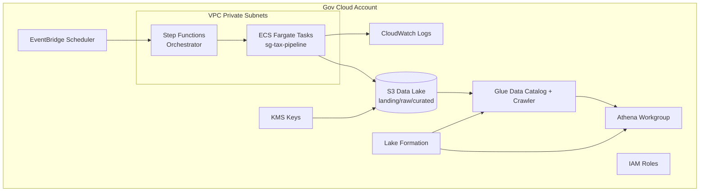

# Cloud Architecture

- **S3** hosts landing/raw/curated data (encrypted with KMS, versioned).
- **Step Functions** orchestrates retries around an **ECS Fargate** task running the Dockerized pipeline.
- **Glue + Athena + Lake Formation** provide SQL and secure analytics for downstream consumers.
- Logs go to **CloudWatch Logs**, with JSON formatting in container environments.
